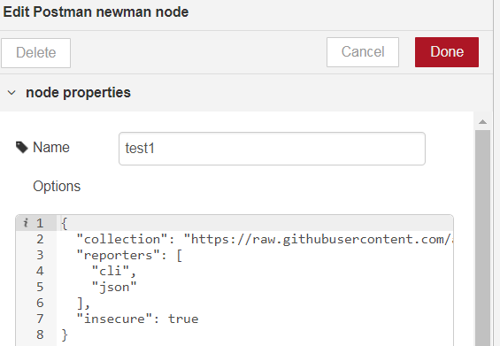

# node-red-contrib-newman

## Summary

Postman's [Newman](https://github.com/postmanlabs/newman) integration in [Node-RED](https://nodered.org/)

You can launch easily a [postman collection](https://www.getpostman.com/collection) using the runner, that is called Newman, within just 1 node:

You can configure the node with the full functionalities that newman offers, since the node's configuration is intented to be a free-text box where configure the options that you want to use that [newman accepts](https://github.com/postmanlabs/newman#newmanrunoptions-object--callback-function--run-eventemitter). This input box is parsed with **mustache**, making more powerfull the execution without the necessity of additional nodes.

## Dependencies

* [newman](https://github.com/postmanlabs/newman): the library for which this project has been build
* [mustache](https://github.com/janl/mustache.js): for rendering the options entered in the node configuration

## Usage and configuration
